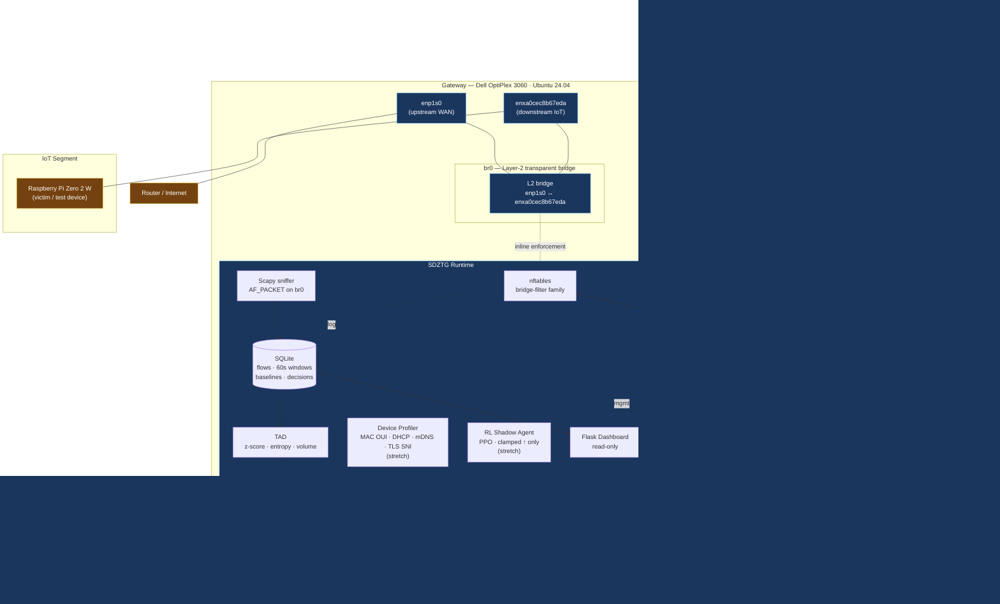

# SDZTG System Architecture

> **Figure 1.1** — the canonical architecture diagram referenced by the README, defense script, and evaluation report.
> Last revised: 2026-06-23 — split into three planes (code, management, data), updated to reflect both NICs and Tailscale management.

---

## 1. Overview

SDZTG is a **Software-Defined Zero-Trust Gateway** that sits inline on the network path between IoT devices and the rest of the network. It enforces a deny-by-default policy at Layer-2 using a transparent Linux bridge, `nftables`, and per-device YAML policies — and augments that enforcement with a Traffic Anomaly Detector (TAD), a Device Profiler, and (stretch goal) a reinforcement-learning shadow agent.

The gateway is **one physical machine** — a Dell OptiPlex 3060 running Ubuntu 24.04 — but its operation is split across three independent planes so that failures in one plane do not cascade into the others.

---

## 2. Deployment Topology — Fig 1.1



### Plane separation (why three planes, not one)

| Plane      | Lives on                  | Failure isolation                                                    |
| ---------- | ------------------------- | -------------------------------------------------------------------- |
| Code sync  | Windows → GitHub → OptiPlex | If GitHub is down, gateway keeps enforcing.                          |
| Management | Tailscale overlay (`tailscale0`) | If Tailscale is down, gateway keeps enforcing. SSH just becomes unavailable until Tailscale recovers. |
| Data       | `br0` (L2 bridge)         | If `br0` crashes, IoT loses internet — but management plane and dashboard remain accessible for recovery. |

This is the property that makes the architecture defensible: a reviewer can reason about each plane's failure mode independently.

---

## 3. Logical Components (inside the OptiPlex)

```
                      ┌──────────────────────────────────────────────────────┐
                      │           Dell OptiPlex 3060 · Ubuntu 24.04            │
                      │                                                       │
                      │   enp1s0 ──┐                                            │
                      │            ├─► br0 (L2 bridge, transparent)            │
                      │   enxa0cec8b67eda ──┘                  ▲                │
                      │                                       │ enforce       │
                      │                                       │ on br0        │
                      │   ┌───────────────────────────────────┼────────────┐  │
                      │   │            SDZTG Runtime           │            │  │
                      │   │                                   ▼            │  │
                      │   │  ┌──────────┐   ┌──────────────────────────┐   │  │
                      │   │  │  Scapy   │──►│  SQLite                  │   │  │
                      │   │  │  sniffer │   │  · flows (60s windows)   │   │  │
                      │   │  │  on br0  │   │  · baselines             │   │  │
                      │   │  └──────────┘   │  · decisions log         │   │  │
                      │   │                  └────────────┬─────────────┘   │  │
                      │   │                                 │                 │  │
                      │   │                                 ▼                 │  │
                      │   │                       ┌──────────────────┐        │  │
                      │   │                       │  TAD             │        │  │
                      │   │                       │  · z-score       │        │  │
                      │   │                       │  · entropy       │        │  │
                      │   │                       │  · volume        │        │  │
                      │   │                       └────────┬─────────┘        │  │
                      │   │                                │ anomaly score   │  │
                      │   │   ┌──────────┐   ┌──────────────▼──────────────┐ │  │
                      │   │   │ Device   │   │  Policy Engine              │ │  │
                      │   │   │ Profiler │──►│  (YAML → decision)           │ │  │
                      │   │   │ (stretch)│   │                             │ │  │
                      │   │   └──────────┘   │  · static allow/deny        │ │  │
                      │   │                  │  · profile-driven posture   │ │  │
                      │   │   ┌──────────┐   │  · RL (clamped, shadow)     │ │  │
                      │   │   │   RL     │──►│                             │ │  │
                      │   │   │  shadow  │   │  decision = allow | throttle │ │  │
                      │   │   │ (stretch)│   │           | quarantine | block│ │  │
                      │   │   └──────────┘   └──────────────┬──────────────┘ │  │
                      │   │                                 │                 │  │
                      │   │                                 ▼                 │  │
                      │   │                       ┌──────────────────┐        │  │
                      │   │                       │  nftables        │────────┼──┘
                      │   │                       │  bridge-filter   │ drops / allows
                      │   │                       └──────────────────┘ on br0 frames
                      │   │                                                 │  │
                      │   │  ┌──────────┐   ┌────────────────────────────┐ │  │
                      │   │  │  Flask   │   │  Alerts                     │ │  │
                      │   │  │  dash    │◄──┤  · Telegram bot             │ │  │
                      │   │  │  (read)  │   │  · generic webhook          │ │  │
                      │   │  └──────────┘   └────────────────────────────┘ │  │
                      │   │                                                 │  │
                      │   └─────────────────────────────────────────────────┘  │
                      │                                                       │
                      └───────────────────────────────────────────────────────┘
```

---

## 4. Data Flow (packet → action)

```
   IoT packet on br0
        │
        ▼
   ┌─────────────┐
   │   Scapy     │  AsyncSniffer, AF_PACKET on br0
   │   sniffer   │  parses: MAC, IP, ports, DNS, TLS SNI
   └──────┬──────┘
          │ row per packet (sampled, not full rate)
          ▼
   ┌─────────────┐
   │   SQLite    │  flows table: device × dest × proto × bytes
   │             │  60-second rolling windows (GROUP BY time_bucket)
   └──────┬──────┘
          │ aggregated windows
          ▼
   ┌─────────────┐
   │   TAD       │  baseline per (device, dest-class)
   │             │  score = z(volume) + entropy(dns_subdomains)
   │             │          + burstiness(new_destinations_per_min)
   └──────┬──────┘
          │ anomaly score per device
          ▼
   ┌──────────────────────────────────────────────────────────────┐
   │                     Policy Engine                            │
   │                                                              │
   │   inputs:                                                    │
   │     · static YAML policy (per-device allow/deny)             │
   │     · Device Profiler posture (stretch)                      │
   │     · RL shadow agent (stretch, clamped ↑ only)              │
   │                                                              │
   │   output: decision ∈ {allow, throttle, quarantine, block}    │
   │                                                              │
   │   logged to: decisions table → dashboard + alerts            │
   └──────┬───────────────────────────────────────────────────────┘
          │ nft -f swap (atomic reload)
          ▼
   ┌─────────────┐
   │  nftables   │  bridge filter family
   │             │  rules live on br0 — drop / rate-limit inline
   └─────────────┘
```

---

## 5. Design Decisions

### Why L2 bridge over L3 routing?
A transparent bridge preserves the IoT device's existing DHCP lease, IP address, gateway, and routing table. The Pi Zero on `192.168.1.x` continues to behave exactly as if the gateway weren't there — which means **zero device-side reconfiguration** is required to deploy.

### Why three planes?
Failure isolation. Each plane can fail independently:
- GitHub down → code sync stalls, gateway still runs
- Tailscale down → SSH lost, gateway still enforces
- `br0` crash → IoT segment loses internet, but management remains reachable so recovery is possible remotely

### Why deny-by-default (FR11)?
New devices start locked to management traffic only. Operators must explicitly approve them and version their policy. This is the zero-trust posture the project name advertises.

### Why is the RL agent shadow-only with a hard clamp?
The static policy engine is sufficient for the project's required-grade functionality. RL is a stretch research contribution; if it ever misbehaves, it must never be able to *weaken* an existing static rule. The clamp ensures `final_action = max(static, agent)` — the agent can only escalate, never loosen.

### Why Scapy over nDPI / Suricata?
Scope. Scapy is sufficient for visibility at IoT scale (a few devices, low throughput). For production deployment, nDPI or Suricata would replace it; this is documented as a known limitation rather than dressed up as a strength.

---

## 6. Threat Model

| Defends against                                              | Notes                                                |
| ------------------------------------------------------------ | ---------------------------------------------------- |
| Lateral movement from a compromised IoT device                | `br0` enforces policy inline on every frame          |
| DNS exfiltration via long / high-entropy subdomains           | TAD flags entropy; Policy Engine quarantines         |
| Beaconing to C2 infrastructure                              | TAD flags periodic volume on small flows              |
| New-destination bursts (scanning / probing)                  | TAD flags `new_destinations_per_min`                 |
| Unauthorized IoT devices joining the segment                 | Deny-by-default; must be approved in YAML             |

| Does **not** defend against                                  | Reason (out of scope)                                |
| ------------------------------------------------------------ | ---------------------------------------------------- |
| Application-layer exploits inside an allowed flow            | Bridge sees L2/L3/L4 only                            |
| Compromised gateway host itself                              | A compromised host is game-over; OS hardening is documented separately |
| Encrypted traffic content analysis                           | TLS not decrypted; only metadata (SNI, JA3) inspected |
| Physical-layer attacks on the bridge cables                 | Physical security is out of scope                    |

---

## 7. Failure Modes

| Failure                                | Detection                              | Recovery                                       | Blast radius              |
| -------------------------------------- | -------------------------------------- | ---------------------------------------------- | ------------------------- |
| `br0` member goes down                 | `bridge link show`                     | `ip link set <nic> up`; if hardware fault, swap NIC | IoT loses internet until fixed |
| `nftables` rule bug locks out device   | Dashboard shows zero traffic from device | `nft -f` reload from previous good YAML       | Single device, until fixed |
| Scapy sniffer crashes                  | `systemctl status sdztg-capture`       | systemd `Restart=on-failure` (5s backoff)     | Visibility only — enforcement still works |
| `br_netfilter` module not loaded       | `cat /proc/sys/net/bridge/bridge-nf-call-iptables` returns `0` after reboot | `modprobe br_netfilter`; ensure `br_netfilter` in `/etc/modules-load.d/sdztg.conf` | Enforcement silently disabled — most dangerous failure mode |
| Tailscale daemon down                  | `tailscale status` from local console  | `sudo systemctl restart tailscaled`          | Mgmt unreachable; gateway still enforces |
| Gateway host kernel panic              | Watchdog timer                        | Hardware reboot (BIOS/APM configured)         | Full outage until host recovers |

---

## 8. See Also

- [`docs/lab_environment.md`](./lab_environment.md) — hardware inventory, NIC table, plane separation
- [`README.md`](../README.md) — top-level project overview
- [`eval/`](../eval/) — attack scenarios, throughput / latency measurements
- `policy/` (TBD) — YAML schema and compiled nftables output
- `rl/` (TBD) — PPO agent, clamp logic, shadow-mode logs
